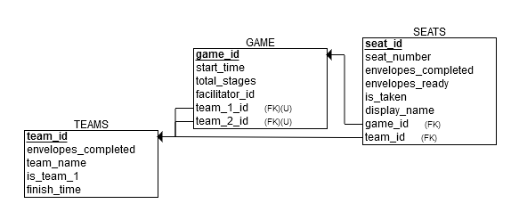

# API and Data Schema Design

## Database design

> See `init.sql`

API endpoints 
* Create new game ( ‘/create/’ request: GET, response: gameId, facilitatorId)
* Join game (‘/join/gameId’ request: GET, response: available seats)
* Choose seat (‘/seatchoice’, request: POST,  arguments: seatId, gameId response: success or not)
* Update team name (‘/updateteamname’, request: POST, arguments: teamId, name, facilitatorId) 
* Update player name (‘updateplayername’, request: POST, arguments: seatId, name)
* Update stages (‘/updatestage/teamId/seatId’ request: POST, arguments: envelopes_completed, envelopes_ready)
* Get game state (‘/getstate/gameId’: GET, response: JSON representation of game state)

Game Mechanics
At each stage the player will:
* Open the envelope via a click
* Type up a randomly generated string
* Pass the envelope to the next person on their team via a click 