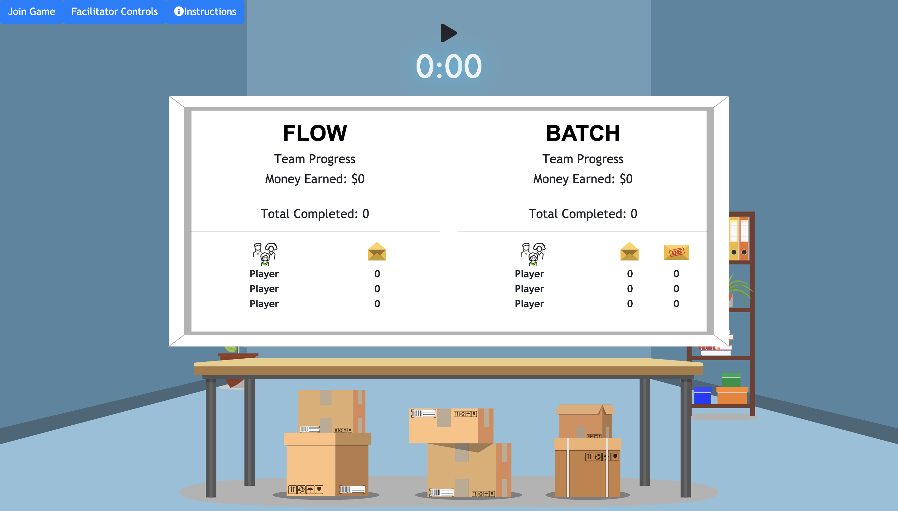

# Envelope Game


### About The Game
The Envelope Game is a simple demonstration that shows the benefits of continuous flow delivery over a traditional large-batch delivery. 
- Six players are divided into two Teams (Flow & Batch).
- One player from each Team is assigned to one of the following roles: Product/Planning, Development, or Quality Assurance.
- Both teams will be given the task of using teamwork to move along the envelopes through the team into delivery of the   envelopes to the customer.
- Each person on the batch team will be designated to work with ten envelopes at a time before handing off to the next partner in their team.
- The Flow Team will have the luxury of passing on the envelopes to their team-mates right after finishing work on one envelope.

### How To Play
- When loading up the game each player will need to click the Choose Seat button and select where they are sitting and what their name will be.
- The facilitator can click the Facilitator Controls button to bring up a screen where they can choose the team names.
- Once all the seats full, the facilitator will press the large Play button on the top of the screen to begin the game.
- The people sitting in the first chair position will start with a stack of 20 envelopes. They will need to click the stack to begin working on their envelope.
- Both sides will click on the active envelope, which will bring up a small matching game. They will click the number that matches the Envelope Stamp above the envelope picture. When they have chosen the correct number it will turn green to denote a proper match.
- When a match has been made the player will need to click the envelope again to close it, and then they can click the button at the bottom to move the envelope on to the next stage.
- The batch side will need to complete 5 envelopes before they can pass them on to the next person.
- The flow side will be able to pass on the envelope as soon as it is complete.
- When all of the seats have completed their tasks the envelop will become "completed" and that team will start to accrue money based on how many envelopes they finished.

## Introducing a bug
At some point the facilitator may wish to show that a flow methodology has the advantage when a bug is introduced and work has to be redone.
- Both sides must have completed envelopes in order to introduce a bug.
- The facilitator will click on the "facilitator controls" button, and then click on the button "Create bug in Envelopes".
- This will bring up a screen with all of the completed envelopes for both sides. The facilitator will need to select an envelope for each side--one for flow, and one for batch--and then click on the "Submit Changes" button.
- The selected envelopes will be switched to a "bugged" state and then they will be moved to the start of the pipeline, and they will be on the top of the pile.
- When the players are redoing these envelopes it will remain in a bugged state until the very last seat.
- For the batch side, the non-bugged envelopes that are sent back will remain in a "finished" state and will need to be slid to the next person by clicking the "finish envelope" button.

### Setup
Install the required node dependencies with npm:
```
npm install
```
### Dependencies

- Docker
- Docker-Compose
- Skaffold
- Helm

### Live Demo
<https://www.envelopegame.com/>

### Running Locally
You can also run it locally with docker compose
```
docker-compose up -d
```
and view it at

<http://localhost:3000/>

### Development Notes
If you make a change to the database you'll need to run: 
```
docker-compose down
```
before running it locally.